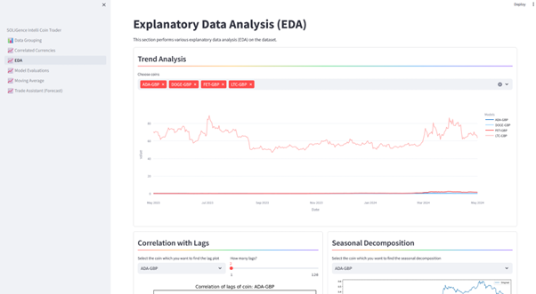

# SOLiGence Intelli Coin Trader
This application is an innovative tool designed for investors. It uses five distinct forecasting models to predict the potential profit or loss from an investment over a given period. By providing these insights, the application empowers users to make informed investment decisions based on the projected returns. It’s not just about tracking investments, but about optimizing them for the future.

## Prerequisites
In order to run this application, please ensure following dependencies met. Its recommended to perform these steps in a **new python virtual environment**.

* python 3.11 or upper
* Install required dependencies (please refer [requirements.txt](requirements.txt))
    > Use following command to install dependencies 
    >
    > `pip install -r requirements.txt`

## How to start
Move to the project home directory and run following command to start the application.

```bash
streamlit run SOLiGence_Intelli_Coin_Trader.py
```

## Application Screenshots

### Trade Assistant View
Assists the trader take decisions with the help of machine learning model.


### Explanatory Data Analysis View
Performs various explanatory data analysis (EDA) on the dataset.




### Moving Average View
Shows the moving average.


